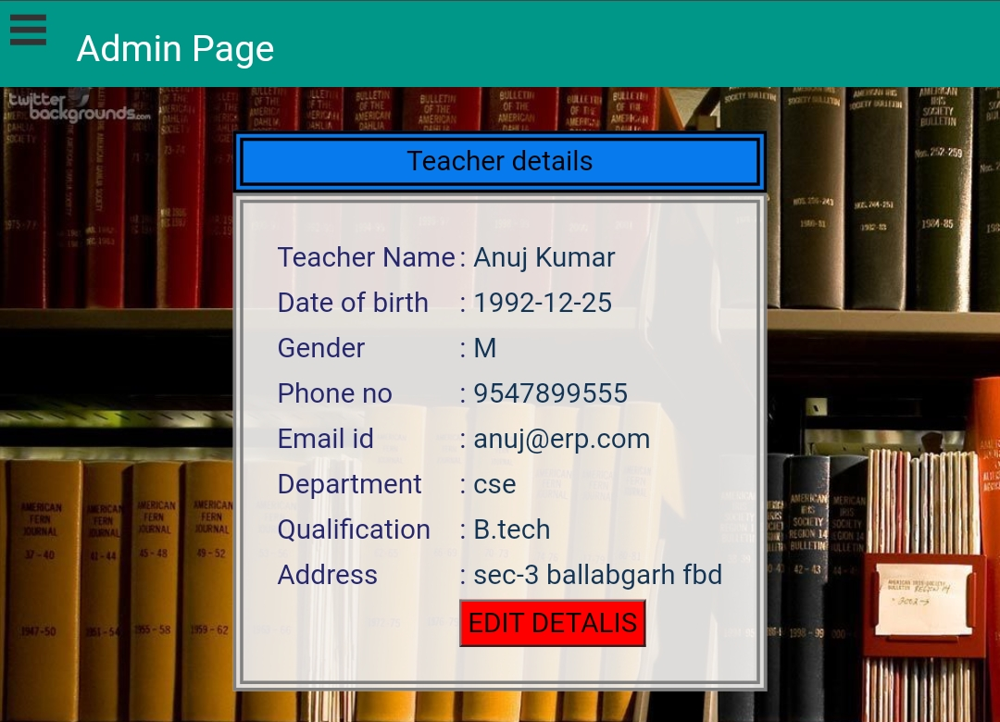
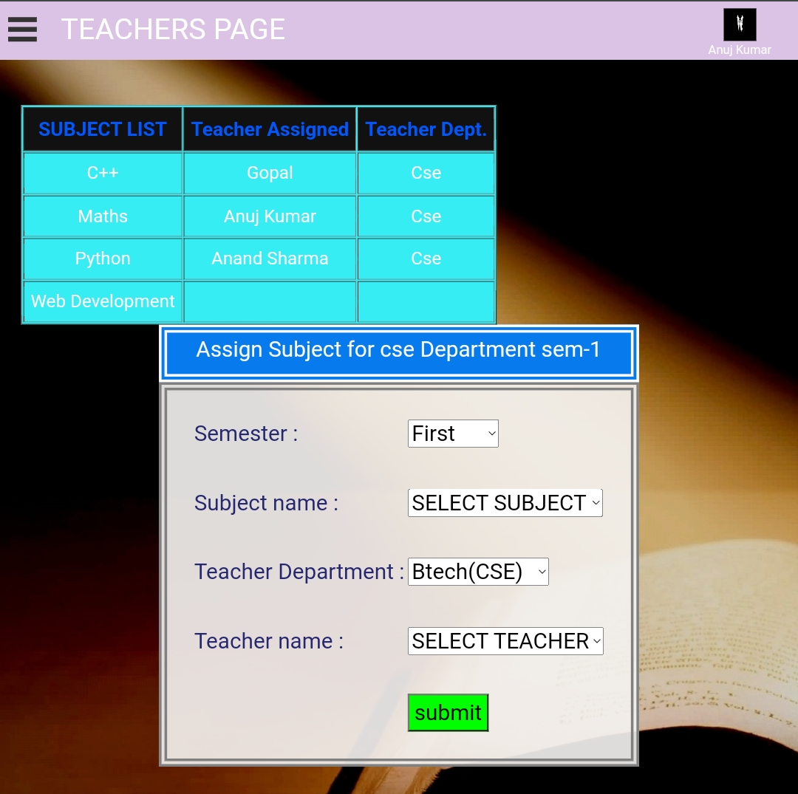
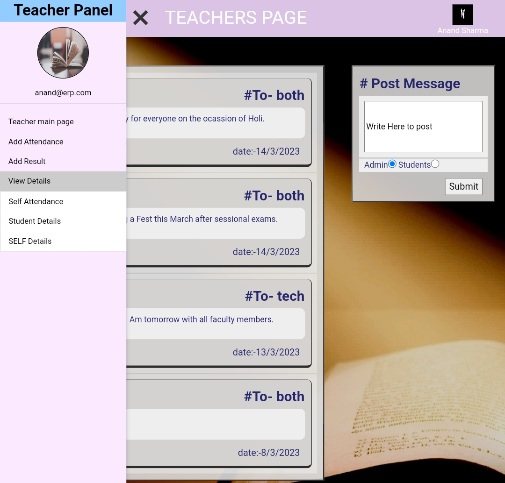
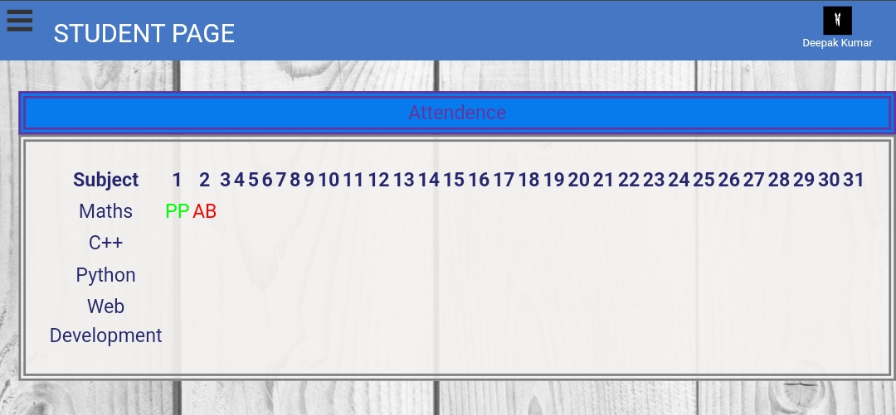

# College-ERP-Website

[Link To Live Project](http://erpweb.epizy.com/firstpage.php)

***

## Modules

1. [Admin](#adminFunctions)

2. [Hod](#hodFunctions)

3. [Teacher](#techFunctions)

4. [Student](#studFunctions)

### [Php, Javascript, HTML, CSS, Bootstrap, mySQL, phpMyAdmin]

1. It is website used to handle the attendance, records and internal communication requirements of a school/college/institute.

2. In this mainly we can take attendance, update and delete records of students and faculty along with the messaging facility.

3. It enables students of each branch to closely watch and track their own performance.

4. It enables teachers to update the records of students like attendance, marks, results and they can directly send messages to the students.

5. It provides some more authorites to the HOD like managing TimeTables, sending broadcast messages to all the teachers or students of their department.

6. Only Admin/registrar have the authorities to add, remove any student or teacher to erp system and can update their records.

## Functionalities

***
### Login Page 

* Single secured login page for all the entities i.e admin, hod, teachers and students.

### Admin Panel

1. **Dashboard** 

    * Gives the insights of the current important messages from teachers or admin of institute. 

    * Allows internal communication between admin, teachers and students.
    

2. **Add Student Record** 

    * Add new student detail to the erp system, this option is only available to admin. 
    
    

3. **Add Teacher record** 
    * Add new student teacher details to the erp system, this functionality is also available to the admin only.

5. **HOD Panel** 
    * Gives insight of the current Head of different departments, and also gives flexibility to assign HOD post to a new teacher.

6. **Add Teachers Attendance** 
    * Here the admin can mark the attendance of all the teachers.

7. **View Students Details** 

    * Here the admin can view the students details as well as the whole class details, it also have a search feature with which the admin can search details of particular students.

8. **View Teachers Details**  

    * Admin can view and edit the details of teachers by searching particular teacher.

9. **Change Account Password** 

    * Admin can update their password whenever required, It requires old password to reset password.

10. **Logout** 

    * This erp system uses the sessions for secure login and logout.

 

### HOD Panel

***

1. **Dashboard** 

    * Gives the insights of the current important messages from teachers or admin of institute. 

    * Allows internal communication between admin, teachers and students.

    

2. **Add Student Attendance** 
    * Here the teachers can mark the attendance of all the students of class, whose subjects are assigned to him.

3. **Add Student Result** 
    * Here the teachers can add and update the students results of assigned subjects.

4. **Add Subject** 
    * This provides the ability to HOD to add new subjects to classes in their department..

5. **Assign Subject to Teachers** 
    * This gives functionality of assigning subjects to the teachers of any department.

6. **View Student Details** 
    * Here the teacher can view the students details as well as the whole class details, it also have a search feature with which the HOD can search details of particular students.

7. **view Self details** 
    * The Teachers can view their own details whenever required.

8. **View Self Attemdance** 
    * Here teachers can view their own attendance record in the institution.

9. **Change Account Password**  

    * HOD can update their password whenever required, It requires old password to reset password.

10. **Logout** 
     * This erp system uses the sessions for secure login and logout.

### Teacher Panel

***

1. **Dashboard** 
    * Gives the insights of the current important messages from teachers or admin of institute. 

    * Allows internal communication between admin, teachers and students.
    

2. **Add Student Attendance** 

    * Here the teachers can mark the attendance of all the students of class, whose subjects are assigned to them.

3. **Add Student Result** 

   * Here the teachers can add and update the students results of assigned subjects.

4. **View Student Details** 
    * Here the teacher can view the students details as well as the whole class details, it also have a search feature with which the teachers can search details of particular students.

5. **view Self details** 
    * The Teachers can view their own details whenever required.

6. **View Self Attemdance** 
    * Here teachers can view their own attendance record in the institution.

7. **Change Account Password**  
    * Teachers can update their password whenever required, It requires old password to reset password.

8. **Logout** 

    * This erp system uses the sessions for secure login and logout.

### Student Panel

***

1. **Dash Board** 
    * Gives the insights of the current important messages from teachers or admin of institute. 

    * Allows internal communication between admin, teachers and students.
    

2. **View Attendance** 
    * Here students can view their own attendance record of all the subjects.

3. **View Result**  
    * The students can view their result of all the semesters and subjects with automatically calculated percentage.

4. **View Self Details** 
    * The students can view their own details whenever required.

5. **View Time table** 
    * The students can view their class time-table set by their Head of Department 

6. **Change Account Password**  

    * Students can update their password whenever required, It requires old password to reset password.

7. **Logout**  

    * This erp system uses the sessions for secure login and logout.

## Technologies

***

A list of technologies used within the project:

* [PHP](https://example.com): Version 12.3 

* [Javascript](https://example.com): Version 2.34

* [CSS](https://example.com): Version 1234

* [BootsTrap](https://example.com): Version 1234

* [MySQL](https://example.com): Version 1234

* [phpMyAdmin](https://example.com): Version 1234
