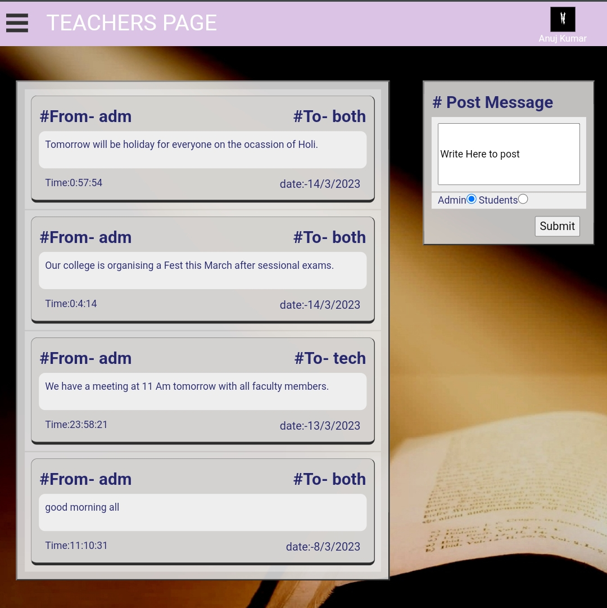

# College-ERP-Website

[Link To Live Project](http://erpweb.epizy.com/firstpage.php)

***

## Modules

1. [Admin](#adminFunctions)

2. [Hod](#hodFunctions)

3. [Teacher](#techFunctions)

4. [Student](#studFunctions)

### [Php, Javascript, HTML, CSS, Bootstrap, mySQL, phpMyAdmin]

1. It is website used to handle the attendance, records and internal communication requirements of a school/college/institute.

2. In this mainly we can take attendance, update and delete records of students and faculty along with the messaging facility.

3. It enables students of each branch to closely watch and track their own performance.

4. It enables teachers to update the records of students like attendance, marks, results and they can directly send messages to the students.

5. It provides some more authorites to the HOD like managing TimeTables, sending broadcast messages to all the teachers or students of their department.

6. Only Admin/registrar have the authorities to add, remove any student or teacher to erp system and can update their records.

## Functionalities

***

### Admin Panel

1. **Dashboard** 

    * Gives the insights of the current important messages from teachers or admin of institute. 

    * Allows internal communication between admin, teachers and students.
    

2. **Add Student Record** 

    * Add new student detail to the system 
    
    

3. **Add Teacher record** 

5. **HOD Panel** 

6. **Add Teachers Attendance** 

7. **View Students Details** 

8. **View Teachers Details**  

9. **Change Account Password** 

10. **Logout** 

 

### HOD Panel

***

1. **Dashboard** 

2. **Add Student Attendance** 

3. **Add Student Result** 

4. **Add Subject** 

5. **Assign Subject to Teachers** 

6. **View Student Details** 

7. **view Self details** 

8. **View Self Attemdance** 

9. **Change Account Password**  

10. **Logout** 

### Teacher Panel

***

1. **Dashboard** 

2. **Add Student Attendance** 

3. **Add Student Result** 

4. **View Student Details** 

5. **view Self details** 

6. **View Self Attemdance** 

7. **Change Account Password**  

8. **Logout** 

### Student Panel

***

1. **Dash Board**

2. **View Attendance** 

3. **View Result**  

4. **View Self Details** 

5. **View Time table** 

6. **Change Account Password**  

7. **Logout**  

* Adding records of students and teachers

* Internal communication between admin, teachers and students

* Managing records like attendance, results and timetables

* Single secured login page for all the entities i.e admin, teachers and students

* Dashboard which gives the insights of the current important messages from teachers or admin of institute.

## Technologies

***

A list of technologies used within the project:

* [PHP](https://example.com): Version 12.3 

* [Javascript](https://example.com): Version 2.34

* [CSS](https://example.com): Version 1234

* [BootsTrap](https://example.com): Version 1234

* [MySQL](https://example.com): Version 1234

* [phpMyAdmin](https://example.com): Version 1234
